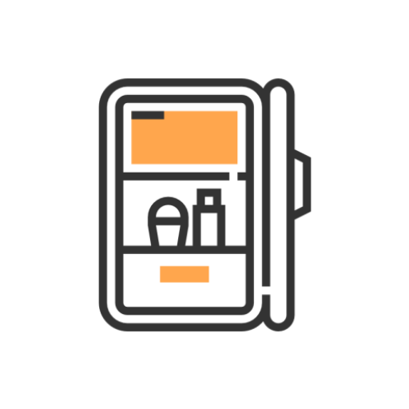
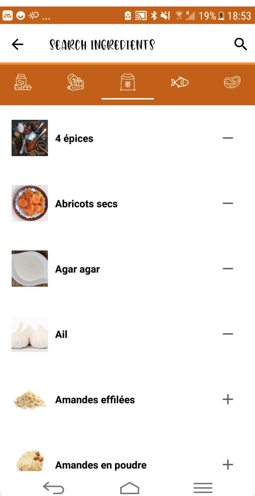
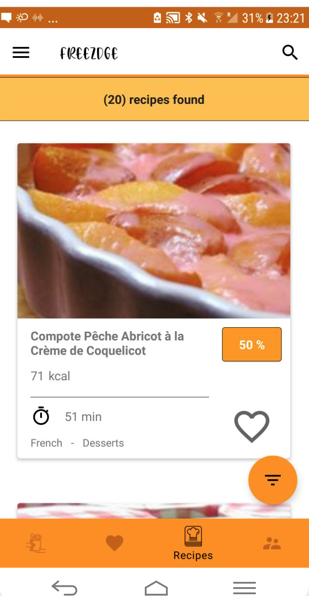
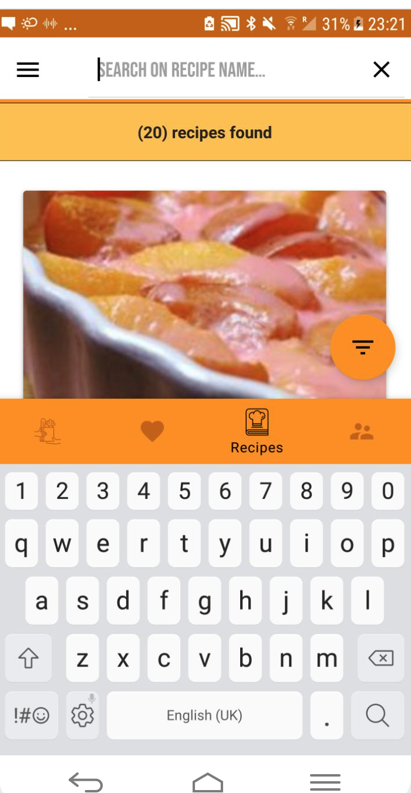
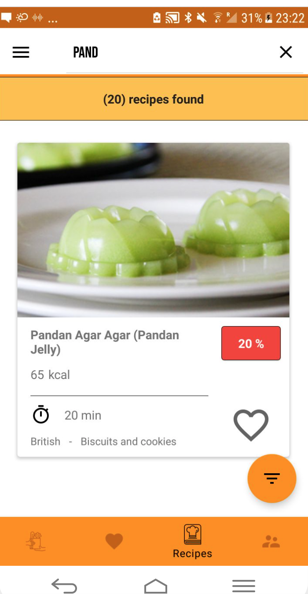
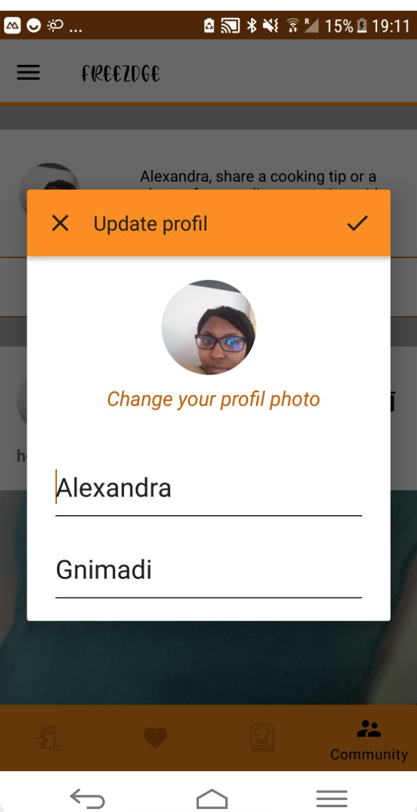
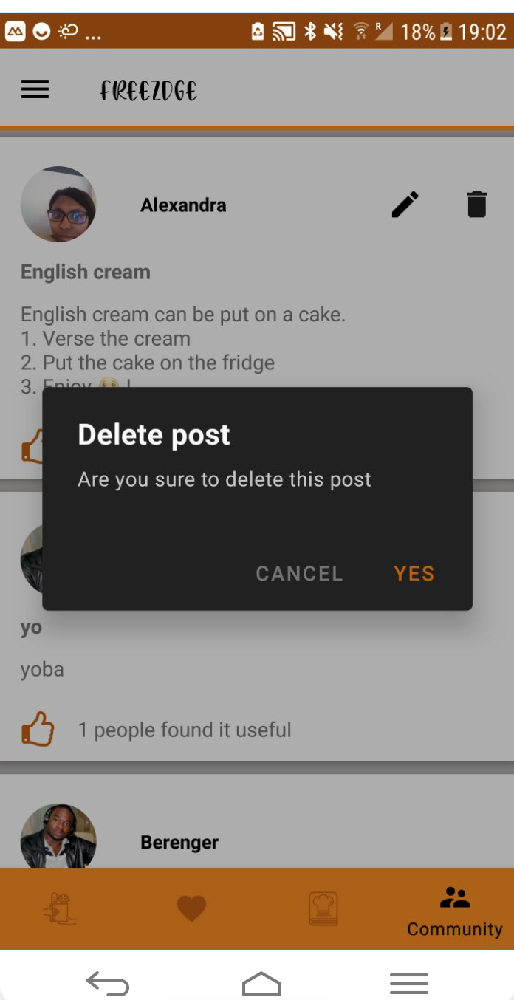

# Freezdge

An android application that lets you find recipes based on what's in your fridge, freezer, or cupboards!

* Add ingredients wich are presents in your fridge, freezer, or cupboards
* Find recipes and see how many ingredients are matching with
* Save your favorites recipes 
* Share your cooking tips or photos of your creations with the Freezdge community

## Choose ingredients according to type

Creamery, fruit and vegetables, groceries, fish, meat

&ensp;

## See ingredients or grocery list

All ingredients in your freezdge ! Also, automatic grocery list is generated when you choose recipes as favorites!

&ensp;

## Find recipes and filter by dish type

&ensp;

## Social media

Share tips or culinary photo with the community !

&ensp;

## Library
* [Android Support Library](https://developer.android.com/topic/libraries/support-library/)
* [Android Architecture Components](https://developer.android.com/topic/libraries/architecture)
* [Gson](https://github.com/google/gson/)
* [Retrofit](https://square.github.io/retrofit/)
* [FastAdapter](https://github.com/mikepenz/FastAdapter)
* [Cloud Firestore](https://firebase.google.com/docs/firestore)
* [Firebase Authentification](https://firebase.google.com/docs/auth)
* [Cloud Storage](https://firebase.google.com/docs/storage)
* [Objectbox](https://github.com/objectbox/objectbox-java)
* [Permissions Dispatchers](https://github.com/permissions-dispatcher/PermissionsDispatcher)
* [Glide](https://github.com/bumptech/glide/)
* [Lottie](https://airbnb.io/lottie/#/)
* [Shimmer](https://facebook.github.io/shimmer-android/)
* [Espresso](https://developer.android.com/training/testing/espresso)
* [Robolectric](http://robolectric.org/)
* [Crashlytics](https://firebase.google.com/docs/crashlytics)

## API
* Edamam

## App Architecture
* MVVM
* Kotlin

## Developed by
Alexandra Gnimadi

Copyright 2020 Alexandra Gnimadi
